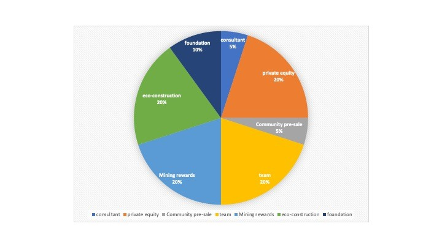
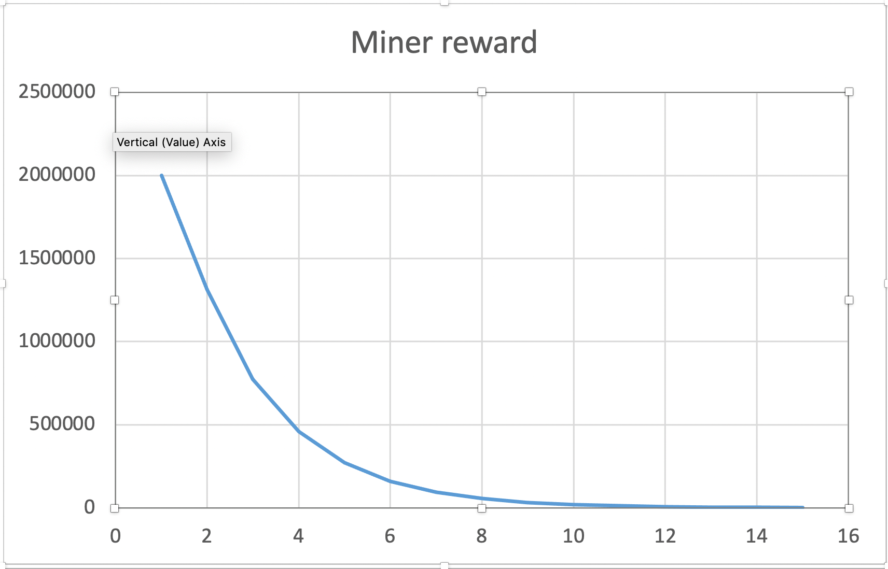

# Whitepaper

# Introduction
## Background
Mankind has experienced the agricultural revolution, industrial revolution, and is experiencing the information revolution. With the development and innovation of digital economy infrastructures such as artificial intelligence, blockchain, cloud computing, and big data in the new round of scientific and technological revolution, digital information has become a key production factor of the digital economy. It empowers the development of the digital economy. As a key factor of production, data should be stored safely, priced accurately, and transmitted reliably before entering into production and circulation. The idea behind Web 3.0 is to bring identity, assets, and data back to the individual through blockchain technology in a decentralized network based on trust and exchange of value. And through cross-chain technology, trust can flow over different decentralized networks so that assets and data can be better transferred and integrated, hence doubling data productivity.

The mechanism by which information outside the blockchain is written into the blockchain is called an oracle. The oracle is the link between the blockchain and the real world. Real-world information is safely, credibly, and efficiently transmitted to the chain, so that heterogeneous chains, contracts, DAPPs, etc., can obtain off-chain data without trust, which is the basis for building a digital economy. Ares' vision is to become a decentralized cross-chain oracle service protocol in the Web 3.0 ecosystem, and to provide secure and reliable data services for the interconnection of the chain and the digital economy.

## Existing plan
As a bridge between on-chain and off-chain, oracle machines are the core of decentralization and data security and credibility. The oracles currently on the market include oracle security, public chain security, and cross-chain security. The 21 nodes previously used by Chainlink to provide data can be called oracle security, while Band and Dos use consensus algorithms to achieve oracle data security and credibility can be called public chain security.

Ares conducts on-chain verification of the oracle data by introducing challengers and reputation committees and achieves the data's finalization. Its principles are similar to the block production mechanism of Babe in Polkadot and  Grandpa finalization, and it can be achieved through on-chain verification of data at  a high level of safety.

## Ares Protocol introduction
Ares is a decentralized hybrid oracle that fully realizes the on-chain and on-chain verification of oracle data. By using VRF to discover the random selection of aggregators, data centralization is solved, and a very low participation threshold is guaranteed. However, the random selection of the aggregator cannot guarantee the accuracy of the data. In order to solve the problem of data valuable, Ares innovatively adopts a challenger model. When the verification node in the network discovers that there is a problem with the data of the aggregator during the process of verifying the data, it only needs to pay a certain amount of Gas to initiate a challenge. The data will be passed to the arbitration organization, composed of honest aggregators and token holders. Under normal circumstances, it does nothing except there is a challenge in the network. Each member of the arbitration organization will initiate a BFT vote on the challenge. If the verification passes, the aggregator will be punished and the challenger will be rewarded.

As an open-source decentralized cross-chain oracle service protocol, Ares builds a decentralized data transaction ecosystem by introducing a token model and community governance. Data demanders can safely and effectively obtain off-chain data and allow high-quality Data providers to profit through on-chain governance and data transactions.

Ares is built under the Polkadot ecology. And it is built through Substrate, as a parachain link to the Polkadot ecology, sharing Polkadot’s security consensus; secondly, Ares is a scalable two-layer oracle network, which is Polkadot’s other parachains and provide decentralized data oracle services with mainstream blockchain networks.

# Technology Architecture
## Participants

### Aggregator
The aggregator obtains external request data through Scanner, and sends the request to the processor to process all Oracle requests. An aggregator is randomly  selected through the VRF algorithm. It calls the processor to aggregate data from multiple data sources and submits it to the block, and broadcasts it to the Ares network through the block propagation protocol.

### Challenger
The challenger verifies the integrity and validity of the data submitted by the aggregator, and submits fraudulent aggregator transactions and correct data to the Reputation Committee for rewards.

### Reputation Committee
By motivating challengers and punishing malicious aggregators, the security of the Area network is ensured. The Reputation Committee is fully self-governing by the community, running for the Reputation Committee through token mortgage and reputation weighting. The internal arbitration of the Reputation Committee needs to vote through the FSP fraud security protocol, and only runs when there is a dispute on the chain.

### Data consumer
Data consumers can be objects that need to obtain external data in smart contracts, parachains, and DAPPs. They can provide various credible and effective data for DEFI, market predicting, and gambling. Because Ares’s on-chain data has a certain data challenge period, data Consumers should obtain data on the chain according to certain safety regulations.

### Node operator
The node operator, as a full node of the Ares network, verifies the data by comparing with the locally stored data to ensure the security of the Ares network and provide Oracle RPC service.

## Detailed design

Ares Protocol is based on Substrate 2.0 and is used as a parallel chain/parallel thread to connect to the Polkadot ecosystem. The specific process is as follows:

1. Polkadot ecological parachain, through the integration of Ares oracle pallet, submit data requests;
2. Scanner obtains external request data and submits it to the aggregator;
3. Ares Chain randomly selects an aggregator through the VRF algorithm;
4. The aggregator calls the processor to aggregate data from multiple data sources and submit it to the Ares blockchain;
5. The verification node will verify the data of the aggregator and challenge;
6. The Reputation Committee verifies the data submitted by the challenger and conducts arbitration.

### How to solve decentralization?
Ares proposed two solutions to avoid the emergence of problem nodes as much as possible, namely distributed data sources and distributed oracles.

#### Distributed data source
Each node operator obtains data from multiple different data sources to reduce the impact of abnormal data sources on the results. Aggregate functions can aggregate multiple returned results into a single answer. There are many solutions to complete data aggregation, such as the weighted average after removing abnormal data.

Data sources may obtain data from each other, which may also lead to errors in aggregation results. We will continue to pay attention to such issues and report on the independence of data sources.

#### Distributed aggregator
The aggregator (i.e., miner) is mainly responsible for providing various types of data, and the challenger (i.e., validator) verifies and challenges the various data provided by the data provider and sends it to the parliament (arbitration institution). The Reputation Committee arbitrates the challenge presented by the data verifier, and if the verification passes, it rewards the challenger and punishes the aggregator.

Among all the aggregator miner nodes that provide data quotations, Ares Network uses a verifiable random function (VRF) to randomly select a group of aggregator nodes to compete to provide the most accurate market data. By introducing VRF into the system, the degree of dispersion of the system can be significantly improved.

Randomly select aggregator nodes through VRF to provide external data on the chain.

After the calculation of VRF, Ares can select the aggregator, and finally determine that a certain aggregator produces blocks at the current height, and verifies the aggregator through zero-knowledge proof. This part will be broadcasted at the same time as the block is produced and the ordinary verification node will verify after receiving the block. If it is within the allowable deviation range, the verification will pass.

### Reputation committee governance
The BFT (Byzantine Fault-Tolerant) algorithm began to be studied in the 1980s to solve the so-called Byzantine Generals problem. The most famous BFT algorithm is PBFT, which is a consensus algorithm based on message passing. In a weakly synchronized network, the algorithm can reach consistency through three stages, and the complexity is O(n2). When an agreement cannot be reached, these stages will be repeated until the timeout.

The advantages of PBFT are fast convergence speed, resource saving, and theoretical security circle (in theory, no more than 1/3 of malicious nodes are allowed to exist, that is, the total number of nodes is 3k + 1, and when there are more than 2k + 1 normal nodes, The algorithm works normally).

Members of the council are selected from aggregators or token holders, and there is a mapping ratio between reputation value and token holdings. Ensure that members of the council will not be manipulated by currency holders. Every time an aggregator submits correct data, its reputation value will increase. A list of council members and a waiting queue will be maintained, and council members will be updated every month. The council can only approve or reject the fraud proof submitted by challengers. Since the challenge is to pay a certain amount of GAS fees, the council does not need to work under normal circumstances. It only needs to handle the dispute when the verifier submits the fraud proof, and can submit the fraud proof to the council. If the committee verifies that the fraud proof passes, it will reward challengers and punish aggregators, and its reputation will decline.

When parliament members deal with challenger disputes, they need to use the BFT algorithm for quick confirmation. A security interval will be set here. If the aggregator puts the data on the chain, the verifier finds a data error during verification and issues it in the next block. It is broadcasted before the block. At this time, the reward received by the challenger for winning is the highest. The reward will be distributed to members of the parliament. A small part of the reward will be distributed to the national treasury. When the data is wrong, it will be used to apply for compensation. Discussed in the governance module.

### How to resolve disputes?

The security of the Ares network is guaranteed by a very strict POS with penalties. If a node operator is identified as an attacker, all Ares tokens pledged by him will be allocated to the reputation committee, challenger, and treasury.

Corresponding to different data markets, such as DEFI, in order to prevent malicious quotations, Ares has designed a challenge mechanism in which the challenger (any Ares full node) can object to the quotation. Initiating a challenge requires paying a small amount of ARES tokens and broadcasting them to the Reputation Committee. Suppose 2/3 of the nodes of the Reputation Committee are audited as malicious. In that case, he will be marked as a malicious node, the mortgaged token is frozen, and the node mortgaged token was transferred to the Reputation Committee, Challenger, and Treasury.

But in extreme cases, when data consumers suffer losses due to malicious nodes reporting data, they can initiate a proposal to the state treasury to apply for compensation, and then vote through the community, and after passing the state treasury to compensate the data consumers.

# Data market
## Decentralized finance
Ares provides high-precision, real-time, safe and reliable off-chain asset data for decentralized finance such as decentralized StableCoins, exchanges, lending, insurance, financial derivatives, etc., which is convenient for the development of DeFi projects out of the box. Stable infrastructure.

## Decentralized identity
Decentralized identity solutions provide secure, controllable and portable digital identities, and provide one-stop solutions for wallet providers, verification providers, DAPP developers and infrastructure providers.

## IoT
Through the Ares Protocol, the Internet of Things devices can be trusted on the chain to solve the problem of identity confirmation and data confirmation of the Internet of Things terminal, ensure the deep binding of data on the chain and application scenarios, and reconstruct the supply chain, food safety, traceability, and smart home industries.

## Prediction market
Decentralized prediction markets, such as Augur and Gnosis, use the wisdom of the crowd to predict real-world results, such as presidential elections and sports betting results.

## Betting games
Ares Protocol will provide verifiable random numbers on the chain, empowering blockchain games and NFTs with more ways to play.

We will issue ARES tokens to incentivize all participants in the system and ensure the growth and development of the ecosystem through community governance. The original circulation is 1 billion pieces.

# Economic model
## Node mortgage
Any third party can access the Ares network as a node by mortgage a small amount of ARES tokens, provide oracle services, and enjoy mining rewards.The total amount of initial tokens in the mining pool accounts for 20%. Every year, 10% of the remaining mining pools are mined and distributed to the nodes. The mining rewards decrease year by year but never finish mining.

## transaction fee
For each oracle request, a processing fee (gas) needs to be paid to the node. 80% of them belong to the aggregators and 20% are handed up to the treasury.

The ARES token will be the first supported fee token, and the holder of the token also has the right to vote to determine which other tokens can also be used as the fee token supported in the Ares network, such as stable coins.

## arbitration
The aggregator or challenger is punished through the challenger dispute, and a part of the fee will be rewarded to the reputation committee.

## Treasury
In the Finance Bureau of the Ares network, treasury funds come from a part of the transaction fee, the punishment of malicious nodes, and inflation caused by pledges. Treasury funds are used to reward challengers, make up for the loss of data demanders, and ecological construction.

Treasury funds can be used by initiating proposals. Any holder of the Ares network can participate in the referendum, and the Ares network can develop healthily through a democratic governance model.

## Community governance
Anyone holding the ARES token has the right to govern, and can vote for protocol upgrades and reputation committee elections. The Reputation Committee ensures the security of the Area network by incentivizing challengers and punishing malicious nodes.

# Recap
Ares is a decentralized oracle solution, which realizes the on-chain and on-chain verification of oracle data. It provides secure and reliable data services for the interconnection and digital economy in the Web3.0 era. Under this agreement, all participants jointly maintain the security of the entire system for their own benefit. We gave a general outline of this architecture, including the various participants in the ecosystem, their economic incentive models and the operations they need to do. We will iterate in the future and provide a more detailed yellow paper to describe the design details, please continue to pay attention.